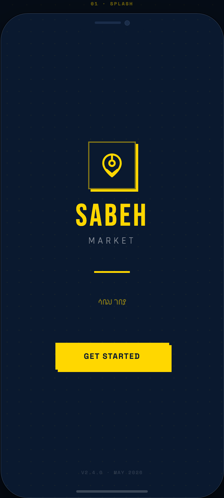
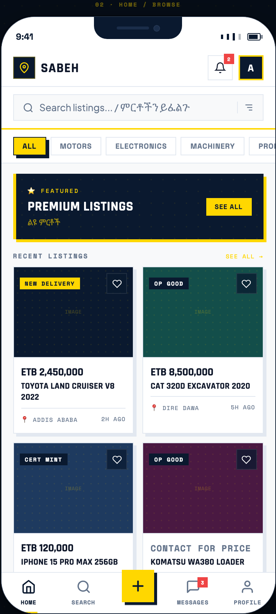
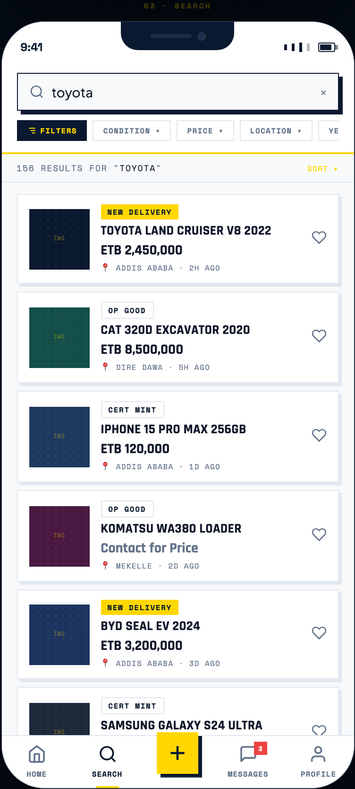
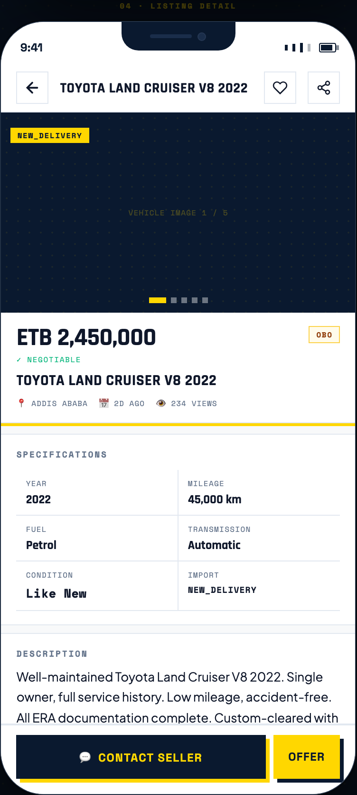
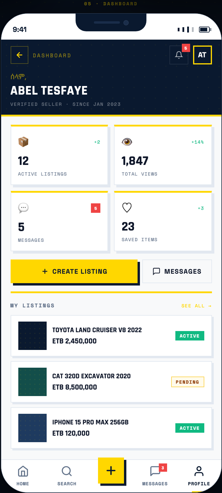

<div align="center">

# Sabeh Mobile

**ሳቤህ ሞባይል — Ethiopia's Marketplace, in Your Pocket**

The native iOS + Android client for [Sabeh Importers](../../README.md). Built with Expo SDK 54, Expo Router 6, NativeWind 4. Designed for Ethiopian buyers and sellers — Amharic-aware, WhatsApp-first, ETB-native.

[Status](#status) · [Screens](#screens) · [Quick start](#quick-start) · [Architecture](#architecture) · [Roadmap](#roadmap)

</div>

---

## Screens

> The images below are **design mockup renders** — the React+Babel single-file source the app was built from, captured headlessly with Playwright. They show design intent and brand language. For up-to-date renders of the running app, see [`scripts/capture-screenshots.sh`](scripts/capture-screenshots.sh) and run it with the emulator open.

<table>
  <thead>
    <tr>
      <th align="center">Splash</th>
      <th align="center">Home / Browse</th>
      <th align="center">Search</th>
    </tr>
  </thead>
  <tbody>
    <tr>
      <td></td>
      <td></td>
      <td></td>
    </tr>
    <tr>
      <td align="center"><sub>Brand intro · Amharic eyebrow · gold CTA</sub></td>
      <td align="center"><sub>Featured banner · 2-col grid · bottom tabs</sub></td>
      <td align="center"><sub>Live filter · category chips · ETB pricing</sub></td>
    </tr>
  </tbody>
</table>

<table>
  <thead>
    <tr>
      <th align="center">Listing Detail</th>
      <th align="center">Seller Dashboard</th>
    </tr>
  </thead>
  <tbody>
    <tr>
      <td width="50%"></td>
      <td width="50%"></td>
    </tr>
    <tr>
      <td align="center"><sub>Image gallery · specs grid · WhatsApp CTA</sub></td>
      <td align="center"><sub>Stats · status breakdown · recent activity</sub></td>
    </tr>
  </tbody>
</table>

<details>
<summary><b>Implementation-only screens</b> (not in the original mockup — capture from emulator)</summary>

These three screens were added during implementation and aren't in the design source. To document them, run `./scripts/capture-screenshots.sh` with the Android emulator open — it walks every route via `adb` deeplinks and drops the PNGs into `docs/screenshots/`.

| Filename | Route | What it captures |
|---|---|---|
| `05-post-listing.png` | `/(tabs)/post` | 4-step wizard — category → details → price+condition → review |
| `06-messages.png` | `/(tabs)/messages` | Inbox with per-thread unread badges |
| `08-my-listings.png` | `/my-listings` | Seller's listings with status filter chips |

</details>

---

## What's special

- **🇪🇹 Ethiopian-first.** ETB / USD currency toggle, Amharic eyebrows on every screen, Ethiopian phone-number formats throughout.
- **💬 WhatsApp deeplinks.** The "Contact" CTA on every listing opens WhatsApp with a pre-filled message — the way Ethiopian buyers and sellers actually transact. Falls back to `tel:` if WhatsApp isn't installed.
- **🎨 Distinctive design.** Navy `#0A192F` + gold `#FFD700`, hard 4px shadows with no blur, 0px border radius everywhere. Reads as *Sabeh* at a glance, not generic SaaS.
- **🧱 Shared types with web.** Listing statuses, conditions, currency, and visual metadata live in [`@sabeh/shared`](../../packages/shared/) — one source of truth that catches drift between the database, the web app, and the mobile app at compile time.
- **⚡ Real photos with smooth loading.** `expo-image` with blurhash placeholders + 200ms transitions. Disk-cached so cold-start scrolls feel instant.

---

## Status

Pre-launch demo build. Domain shapes match production; data sources do not yet.

| Surface | State | Notes |
|---|---|---|
| **Browse / Home / Search** | 🟡 Mock | 6 sample listings in `lib/mock-data.ts`. Will swap to `/api/marketplace`. |
| **Listing Detail** | 🟡 Mock | Real Unsplash photos in 3-image gallery; specs are stubbed. |
| **WhatsApp deeplink** | ✅ Live | `whatsapp://send` with pre-filled message; `wa.me` fallback for browser. |
| **Phone call deeplink** | ✅ Live | `tel:` from any listing's bottom action bar. |
| **Seller Dashboard** | 🟡 Mock | Stats derived from mock data; status breakdown matches DB enum exactly. |
| **My Listings** | 🟡 Mock | All 5 user-visible statuses represented (Active / Pending / Sold / Expired / Draft). |
| **Post-a-Listing wizard** | 🟡 UI only | 4 steps complete, submit button is inert until API + image upload land. |
| **Messages** | 🟡 Mock | 3 hardcoded threads; no real-time yet. |
| **Auth** | ❌ Not built | No login flow. Profile screen hardcoded to "Abebe Girma". |
| **Image upload** | ❌ Not built | Wizard step 1 has no picker; wired to nothing. R2 creds already in `.env`. |
| **Push notifications** | ❌ Not built | Needs Expo Notifications + a backend push endpoint. |

Legend: ✅ live · 🟡 mock data, real shape · ❌ not built

---

## Quick start

### Prerequisites

- **Node 20+** (same as the web app)
- **pnpm** — repo standard
- **Expo Go** on your phone, *or* an Android emulator (Android Studio) / iOS Simulator (Xcode, macOS only)

### Run it

```bash
cd apps/mobile
pnpm install
pnpm dlx expo install --fix    # one-time alignment to SDK 54 canonical versions
pnpm start                     # Metro + QR
```

Then either:
- **Phone:** scan the QR with Expo Go (~10s to load over LAN)
- **Android emulator:** press `a` in the terminal
- **iOS Simulator:** press `i` (macOS only, Xcode required)

If Metro loads from a stale cache after pulling new code, run `pnpm start --clear`.

### Capture fresh screenshots

Two sources, two scripts:

```bash
# Live app — requires Android emulator running with the app loaded.
# Walks every route via adb deeplinks, drops PNGs in docs/screenshots/.
./scripts/capture-screenshots.sh

# Design mockups — Playwright + headless Chromium against the original
# Sabeh Mobile Flow HTML. No emulator needed.
node ./scripts/render-mockups.mjs
```

The mockup renders are useful for docs, pitch decks, and as the design north-star. The live captures are the source of truth for "what the app actually looks like today."

---

## Architecture

### Workspace layout

```
sabeh-importers/                    ← repo root (Next.js web app)
├── packages/
│   └── shared/                     ← cross-app types & enums (@sabeh/shared)
│       ├── enums.ts                ListingStatus, ListingCondition, Currency
│       ├── status-meta.ts          Visual metadata for status badges
│       ├── categories.ts           Marketplace categories + condition labels
│       └── format.ts               formatPrice() helper
├── src/                            ← web (Next.js + Drizzle + Postgres)
└── apps/mobile/                    ← THIS APP (Expo + RN)
    ├── app/                        Expo Router file-based routes
    │   ├── _layout.tsx             Root: fonts + <Stack>
    │   ├── index.tsx               /  → Splash
    │   ├── (tabs)/                 Bottom tabs (Home / Search / Post / Msgs / Profile)
    │   ├── listing/[id].tsx        Listing detail
    │   ├── messages/[id].tsx       Message thread
    │   └── my-listings.tsx         Seller listings management
    ├── components/
    │   ├── ui/                     Button, Card, Badge primitives
    │   ├── sabeh-logo.tsx          Brand mark (inline SVG)
    │   └── listing-card.tsx        Grid tile with expo-image thumbnail
    ├── lib/
    │   ├── theme.ts                Color/shadow tokens
    │   ├── contact.ts              WhatsApp + tel: deeplink helpers
    │   └── mock-data.ts            Demo data; types re-exported from @sabeh/shared
    ├── docs/screenshots/           README assets (gitignored optional)
    ├── scripts/
    │   ├── capture-screenshots.sh  Live emulator → PNGs (adb-based)
    │   └── render-mockups.mjs      Design mockup → PNGs (Playwright)
    ├── app.json                    Expo config (icon, splash, scheme)
    ├── babel.config.js             babel-preset-expo + nativewind/babel
    ├── metro.config.js             watchFolders → packages/shared, pnpm symlinks
    └── tsconfig.json               extends expo/tsconfig.base; @sabeh/shared alias
```

### Why a shared package, not a workspace

We use **TypeScript path aliases + Metro `watchFolders`** rather than a formal pnpm workspace declaration. Reason: the repo started as a single Next.js app at root and grew the mobile app into `apps/mobile/`. Adding `pnpm-workspace.yaml` mid-flight risked lockfile drift on a project that already had stable installs.

The result: both apps import `@sabeh/shared`, types stay aligned, and neither `package.json` had to change. If we outgrow this (e.g., the shared package gains its own dependencies), graduating to a real workspace is a one-config change away.

### Tech stack

| Layer | Choice | Why |
|---|---|---|
| Framework | **Expo SDK 54** + Expo Router 6 | File-based routing, OTA updates, deep linking, single config |
| Styling | **NativeWind 4** | Web-parity Tailwind tokens; same color/spacing scale as the Next.js app |
| Icons | **@expo/vector-icons** (Feather + FontAwesome) | Bundled, no extra install; FontAwesome for the WhatsApp glyph |
| Images | **expo-image** | Disk cache + blurhash + transition; far better than RN's `Image` |
| Fonts | **@expo-google-fonts** — Space Grotesk / Space Mono / DM Sans | Matches web display/label/body stack |
| State | Component state + module-scoped constants for static data | No Zustand/Redux yet — added when real auth + API land |
| Type safety | **Strict TS**, types shared with web via `@sabeh/shared` | Drift between mobile mock and DB schema is now a compile error |

### Design system

Matches the Sabeh web app's tokens 1:1:

- **Colors:** navy `#0A192F`, gold `#FFD700`, command white `#F8F9FA`
- **Typography:** Space Grotesk (display) → Space Mono (labels) → DM Sans (body)
- **Geometry:** 0px border-radius everywhere
- **Shadows:** hard 4px navy offset, no blur — see [`lib/theme.ts → shadows.hard`](lib/theme.ts)

> RN's native shadow API can't perfectly replicate `box-shadow: 4px 4px 0px #0A192F` with no blur on iOS. Closest approximation is shipped; deferred a pixel-perfect "navy view behind the element" approach until it matters.

---

## Roadmap

In order of execution priority, based on customer feedback and technical dependency.

### Pre-launch (next 2–4 weeks)
1. **Phone-OTP auth** — exchange OTP for JWT, store in `expo-secure-store`. Without this, every other API integration is blocked.
2. **Wire to real API** — replace `LISTINGS` / `MY_LISTINGS` / `CONVERSATIONS` with `useQuery` against existing `/api/marketplace`, `/api/messages`. Shared types in `@sabeh/shared` mean the data shape already matches.
3. **Image upload pipeline** — connect post-listing wizard step 1 to Cloudflare R2 (creds already in `.env`).

### Launch + 1
4. **Real-time messaging** — WebSockets or Pusher for live message delivery; current UI already supports unread badges.
5. **Telebirr / CBE Birr** — the "Make Offer" → escrow flow. Long pole; partnership conversation should start now.
6. **Push notifications** — Expo Notifications + backend push endpoint.

### Post-launch polish
7. **Amharic ↔ English language toggle** — data already has `titleAm`; UI just needs the switch.
8. **Saved searches + wishlist sync** with the web app.
9. **Pixel-perfect hard shadow** on iOS.

---

## Common commands

```bash
pnpm start              # Metro dev server with QR
pnpm start --clear      # Clear cache (after metro.config or shared-package changes)
pnpm ios                # Open in iOS Simulator (macOS + Xcode required)
pnpm android            # Open in Android emulator (Android Studio required)
pnpm web                # Open in browser (RN-Web — limited)
pnpm type-check         # tsc --noEmit  (also run from repo root for web)
```

---

## Distribution

- **Internal sharing today:** Expo Go QR is enough. Anyone on the same network scans and runs.
- **TestFlight / Play Store internal track:** requires `eas build`. EAS account is free; iOS still requires the $99/yr Apple Developer membership; Android Play Console is a one-time $25.
- **Production stores:** standard Apple / Google review.

---

## Caveats

- **Splash assets** referenced in `app.json` (`assets/icon.png`, `assets/splash.png`, `assets/adaptive-icon.png`) are not yet generated. Expo uses defaults until they are. Source from the web app's `/public/Sabeh_Logo_Icon.svg`.
- **Demo image URLs** in `lib/mock-data.ts` point at Unsplash CDN. They're for development only; replace with R2 URLs once the upload pipeline ships.
- **Lucide is intentionally not used** here (web uses `lucide-react`). Mobile uses `@expo/vector-icons/Feather` + `FontAwesome` — same glyph language, zero extra install footprint.

---

<div align="center">
<sub>Part of the <a href="../../README.md">Sabeh Importers</a> platform. Made for Ethiopia 🇪🇹.</sub>
</div>
